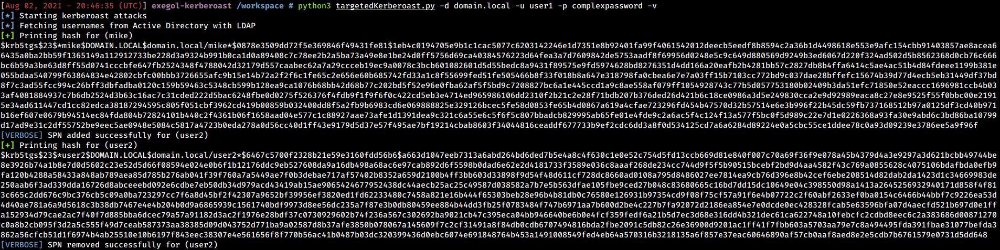

# targetedKerberoast

targetedKerberoast is a Python script that can, like many others (e.g. [GetUserSPNs.py](https://github.com/SecureAuthCorp/impacket/blob/master/examples/GetUserSPNs.py)), print "kerberoast" hashes for user accounts that have a SPN set. 
This tool brings the following additional feature: for each user without SPNs, it tries to set one (abuse of a write permission on the `servicePrincipalName` attribute), print the "kerberoast" hash, and delete the temporary SPN set for that operation. This is called targeted Kerberoasting.
This tool can be used against all users of a domain, or supplied in a list, or one user supplied in the CLI.

More information about this attack
 - [The Hacker Recipes - Kerberoast](https://www.thehacker.recipes/ad/movement/kerberos/kerberoast)
 - [The Hacker Recipes - Targeted Kerberoasting](https://www.thehacker.recipes/ad/movement/access-controls/targeted-kerberoasting)

# Usage

This tool supports the following authentications
 - (NTLM) Cleartext password
 - (NTLM) [Pass-the-hash](https://www.thehacker.recipes/active-directory-domain-services/movement/lm-and-ntlm/pass-the-hash)
 - (Kerberos) Cleartext password
 - (Kerberos) [Pass-the-key](https://www.thehacker.recipes/ad/movement/kerberos/ptk) / [Overpass-the-hash](https://www.thehacker.recipes/ad/movement/kerberos/opth)
 - (Kerberos) [Pass-the-cache](https://www.thehacker.recipes/ad/movement/kerberos/ptc) (type of [Pass-the-ticket](https://www.thehacker.recipes/ad/movement/kerberos/ptt))

Among other things, targetedKerberoast supports multi-level verbosity, just append `-v`, `-vv`, ... to the command :)

```
usage: targetedKerberoast.py [-h] [-v] [-q] [-D TARGET_DOMAIN] [-U USERS_FILE] [--request-user username] [-o OUTPUT_FILE] [--use-ldaps] [--only-abuse] [--no-abuse] [--dc-ip ip address] [-d DOMAIN] [-u USER]
                             [-k] [--no-pass | -p PASSWORD | -H [LMHASH:]NTHASH | --aes-key hex key]

Queries target domain for SPNs that are running under a user account and operate targeted Kerberoasting

optional arguments:
  -h, --help            show this help message and exit
  -v, --verbose         verbosity level (-v for verbose, -vv for debug)
  -q, --quiet           show no information at all
  -D TARGET_DOMAIN, --target-domain TARGET_DOMAIN
                        Domain to query/request if different than the domain of the user. Allows for Kerberoasting across trusts.
  -U USERS_FILE, --users-file USERS_FILE
                        File with user per line to test
  --request-user username
                        Requests TGS for the SPN associated to the user specified (just the username, no domain needed)
  -o OUTPUT_FILE, --output-file OUTPUT_FILE
                        Output filename to write ciphers in JtR/hashcat format
  --use-ldaps           Use LDAPS instead of LDAP
  --only-abuse          Ignore accounts that already have an SPN and focus on targeted Kerberoasting
  --no-abuse            Don't attempt targeted Kerberoasting

authentication & connection:
  --dc-ip ip address    IP Address of the domain controller or KDC (Key Distribution Center) for Kerberos. If omitted it will use the domain part (FQDN) specified in the identity parameter
  -d DOMAIN, --domain DOMAIN
                        (FQDN) domain to authenticate to
  -u USER, --user USER  user to authenticate with

secrets:
  -k, --kerberos        Use Kerberos authentication. Grabs credentials from .ccache file (KRB5CCNAME) based on target parameters. If valid credentials cannot be found, it will use the ones specified in the
                        command line
  --no-pass             don't ask for password (useful for -k)
  -p PASSWORD, --password PASSWORD
                        password to authenticate with
  -H [LMHASH:]NTHASH, --hashes [LMHASH:]NTHASH
                        NT/LM hashes, format is LMhash:NThash
  --aes-key hex key     AES key to use for Kerberos Authentication (128 or 256 bits)
```

Below is an example what the tool can do.



# Credits and references

Credits to the whole team behind [Impacket](https://github.com/SecureAuthCorp/impacket/) and its contributors.
